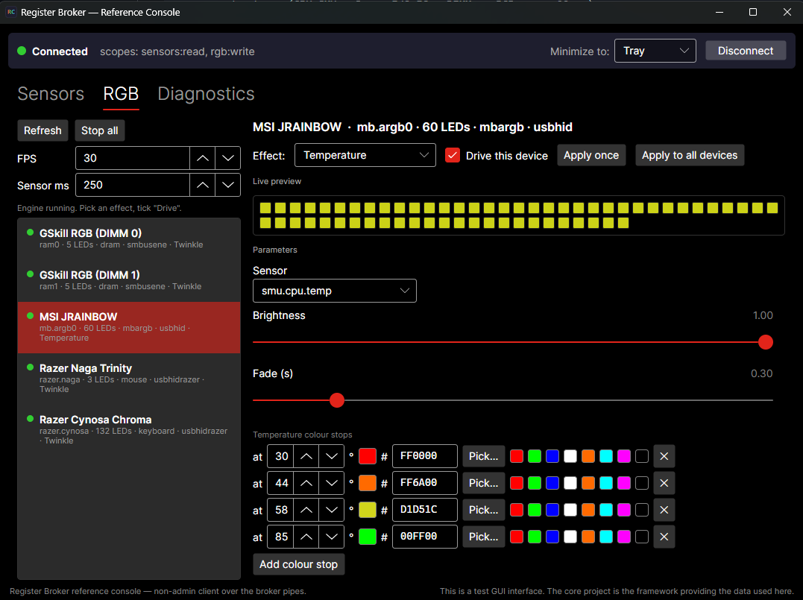
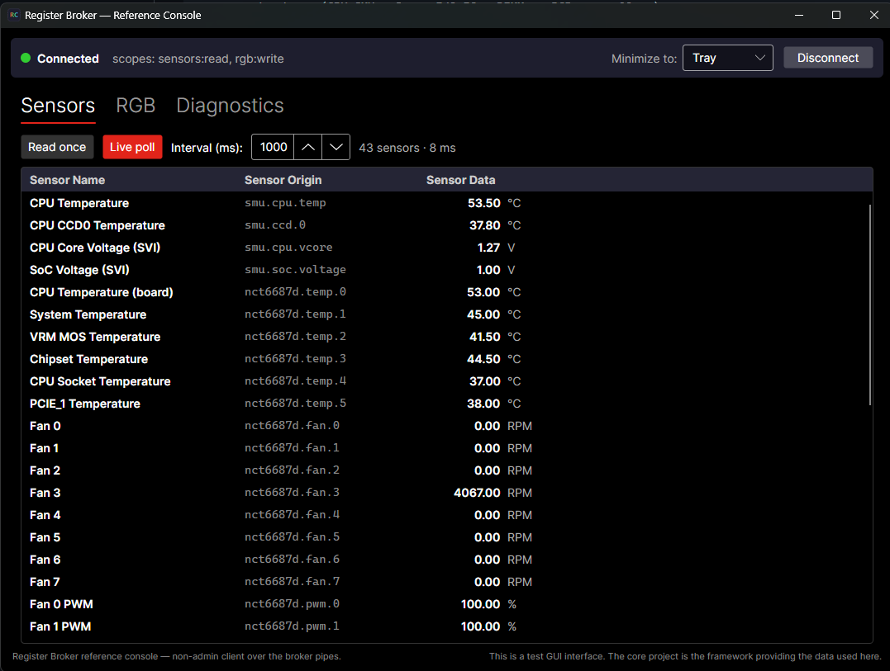
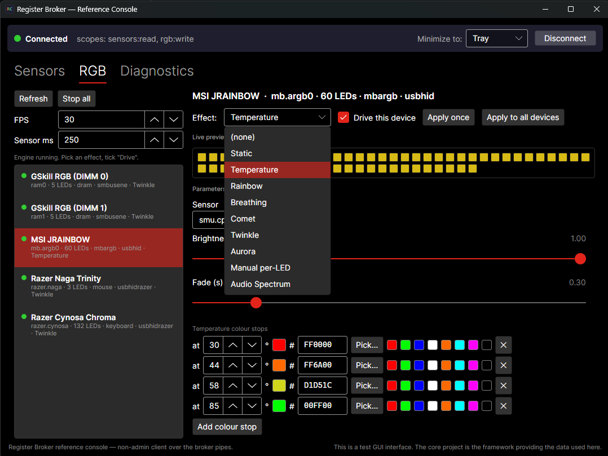
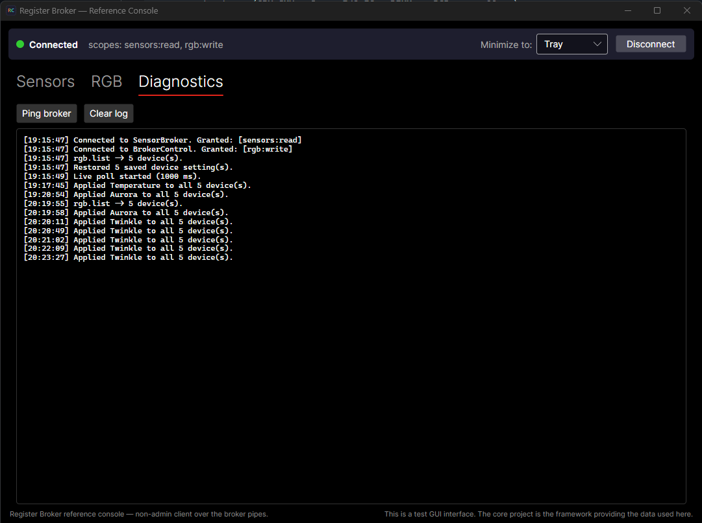

# Register Broker

**Universal Low-Level Hardware Access Framework** — secure, controlled, audited access
to PC sensors and RGB hardware for **non-admin** applications, with no vulnerable
kernel drivers (no WinRing0) and no per-app elevation.

One narrow, signed kernel driver and one authenticated broker service read the
hardware **once**; any number of unprivileged clients consume named, pre-mapped data
over a local pipe. Clients name a *logical register* (`smu.cpu.temp`, `ram0`) —
**never an address** — and cannot scan, probe, or write outside the broker's baked,
kernel-enforced map.



> The first-party **[Reference Console](docs/REFERENCE-CONSOLE.md)** above is an ordinary,
> non-admin desktop app — no elevation, no kernel driver of its own — driving RAM, a
> motherboard ARGB header, and Razer peripherals together through the broker. That's the whole
> thesis in one window.

```
 non-admin clients (any app speaking the pipe protocol)
        │  \\.\pipe\SensorBroker        \\.\pipe\BrokerControl
        │  sensor.list / read / readall  rgb.list / rgb.set
        ▼                                      ▼
 ┌──────────────────────────┐   ┌──────────────────────────────┐
 │ SensorBroker service     │   │ BrokerControl service        │
 │ (LocalSystem)            │   │ (LocalSystem, write-only)    │
 │  auth: DACL + peer       │   │  same gate + rgb:write scope │
 │  identity + signer pin   │   │                              │
 │  rate limit · sessions   │   │  per-LED atomic block frames │
 │  audit log · catalog +   │   │                              │
 │  calibration data        │   │                              │
 └────────────┬─────────────┘   └──────────────┬───────────────┘
              │        \\.\BrokerSmbus (SYSTEM+Admins only)
              ▼                                ▼
 ┌──────────────────────────────────────────────────────────────┐
 │ BrokerSmbus kernel driver (non-PnP KMDF, sequential, narrow) │
 │  bounded reads: SMBus · AMD SMU · Super-I/O (named registers)│
 │  bounded writes: SMBus block ≤32 B, in-kernel address        │
 │  allow-list ("brick guard": RGB windows only, never SPD)     │
 └──────────────────────────────────────────────────────────────┘
              │ SMBus / SMN / LPC port I/O
              ▼
         hardware (CPU SMU · Super-I/O EC · DIMMs · RGB controllers)
```

## Why

Today every monitoring/RGB tool ships its own kernel driver (often WinRing0 — signed,
vulnerable, on Microsoft's block list) and runs elevated. Register Broker replaces
that model with a **register database** approach: trusted, audited code knows *where*
registers live; calibration **data** (JSON, no addresses) maps them to human labels
per board; clients get values by **id** through an authenticated, rate-limited,
audited broker. Privilege is scoped to one small service instead of every consumer.

## Vision

Register Broker isn't really about RGB. RGB is the proof.

The convenience features people actually want — read a temperature, set an LED color,
nudge a fan curve — are gated behind software that takes far more than it needs:
elevated apps, broad kernel drivers (often WinRing0, on Microsoft's vulnerable-driver
block list), raw register access, and always-on privileged services. Gamers, builders,
and non-technical users install proprietary monitoring and lighting suites with no way
to know how much of their system they just handed over.

The broker model inverts that. Privilege collapses into one small, narrow, auditable
driver that does only bounded, named operations; every consumer stays non-admin; access
is validated, scoped, rate-limited, audited, and exposed through a safe abstraction
instead of uncontrolled register traffic — which also removes a whole class of crashes
and bricks caused by software poking hardware it doesn't understand.

A first-party desktop application — the **[Reference Console](docs/REFERENCE-CONSOLE.md)** —
already reads every sensor and drives every supported RGB device through the broker with no
elevation. The model works, end to end, and you can see it: sensors, DRAM RGB, motherboard
ARGB headers, and Razer peripherals, all from one non-admin GUI. The next milestone is
production driver signing, so it runs outside Windows test mode and coexists cleanly with
modern Windows security (Secure Boot, HVCI, vulnerable-driver blocking).

From there the same pattern generalizes far past lighting: sensor monitoring, fan
control, diagnostics, and motherboard utilities all lean on elevation for convenience,
not necessity. The long-term goal is a standardized, non-privileged Windows
hardware-access surface — where reading a sensor or setting a color is a safe, ordinary
capability, and the pressure is on vendors to behave better instead of on users to
trust blindly.

## What works today

**43-sensor catalog** (incl. read-only fan-PWM duty) served to non-admin clients over authenticated pipe; RGB drivable on DRAM, **motherboard headers, and USB peripherals (Razer)**.

| Capability | Mechanism | Status |
|---|---|---|
| CPU die temp + per-CCD (Ryzen) | AMD SMU Tctl + CCD reads over SMN | ✅ hardware-validated |
| CPU core + SoC voltage (Ryzen) | AMD SVI2 telemetry over SMN (Matisse/Vermeer) | ✅ hardware-validated (5800X3D) |
| Board temps / fans / voltages | Nuvoton NCT6683 EC (0xC730) | 🟡 implemented, HW-unvalidated |
| Board temps / fans / voltages | Nuvoton NCT6686 EC (0xD440) | 🟡 implemented, HW-unvalidated |
| Board temps / fans / voltages | Nuvoton NCT6687D EC (0xD590) | ✅ hardware-validated |
| Board temps / fans / voltages | Nuvoton NCT6775 family (6779, 6791–6798) | 🟡 implemented, HW-unvalidated |
| Fan PWM duty % (read-only telemetry) | NCT668x EC duty byte → `nct6687d.pwm.*` (no fan-write path) | ✅ hardware-validated (NCT6687D) |
| DIMM temperatures | JC42 / TSE2004av over SMBus | ✅ hardware-validated |
| Per-LED DRAM RGB (non-admin!) | ENE/Aura (block write, 1–32 B atomic) | ✅ hardware-validated |
| Motherboard ARGB headers (non-admin!) | MSI Mystic Light over USB-HID (JRAINBOW) | ✅ hardware-validated (MSI B550I) — opt-in |
| Peripheral RGB (non-admin!) | Razer Chroma keyboards/mice over USB-HID | ✅ hardware-validated (Naga Trinity, Cynosa Chroma) — opt-in |
| Motherboard 12V header | NCT6687 EC RGB (JRGB) | 🟡 wired + brick-guarded, inert pending EC-register validation |
| AMD SMBus host (FCH KERNCZ) | SMBus sequential controller | ✅ hardware-validated |
| Intel SMBus host (i801) | SMBus sequential controller | ⬜ implemented, HW-unvalidated |

Full inventory: [docs/SENSOR-CHIPSET-INVENTORY.md](docs/SENSOR-CHIPSET-INVENTORY.md) · Read the inventory for complete per-backend chipset details.

## The Reference Console (the proof, with a GUI)

The framework ships a first-party, **non-admin desktop application** — the **Reference
Console** ([`Test_GUI/ReferenceConsole/`](Test_GUI/ReferenceConsole/)) — that drives the
whole framework through nothing but the public pipe protocol. It is the demonstrator: an
ordinary user-mode process, no elevation and no kernel driver of its own, reading the full
sensor catalog and lighting DRAM, motherboard ARGB headers, and Razer peripherals — exactly
what any third-party consumer could do.

- **Sensors tab** — live-polls `sensor.readall`; the session reports `elevated=False`.
- **RGB tab** — a **client-side** effect engine (Static, Temperature-reactive, Rainbow,
  Breathing, Comet, Twinkle, Aurora, Manual per-LED, Audio Spectrum). Every animation is rendered in the
  client and streamed as solid-color frames through the existing `rgb.set` op — **no broker
  or driver change** — proving the broker stays a pure, auditable transport while consumers
  do the rich work.
- **Diagnostics tab** — granted scopes, ping/latency, raw protocol log.

| Sensors | Effects | Diagnostics |
|---|---|---|
|  |  |  |

Stack: **.NET 10 + Avalonia 12** (the console is a separate build). Full walkthrough,
requirements, and build/run steps:
[docs/REFERENCE-CONSOLE.md](docs/REFERENCE-CONSOLE.md).

There's also a standalone, **non-admin** music-sync consumer —
[`RgbAudioReactive/`](RgbAudioReactive/) (.NET 10 + NAudio) — that reacts to your microphone
or system audio and drives every zone the broker exposes, over the same public control pipe.
A downloader gets the GUI, its full effect engine, and this ready-to-run audio tool.

## RGB status (read this before expecting your build to light up)

RGB is **board-aware and multi-transport**. `RgbCatalog` is a DMI-matched board profile of
zones; the client contract (`rgb.list` / `rgb.set`) is identical across transports, but what
*bounds* each write differs:

| Transport | Hardware | Safety boundary | Status |
|---|---|---|---|
| SMBus (ENE/Aura) | DRAM modules | **kernel** address brick-guard (`0x70–0x77` / `0x39–0x3A`) | ✅ validated (G.Skill DDR4) |
| USB-HID (MSI Mystic Light) | addressable motherboard headers (JRAINBOW) | **broker** baked report builder + PID pin, *no kernel guard* | ✅ validated (MSI B550I); **opt-in** |
| USB-HID (Razer Chroma) | keyboards / mice (board-independent) | **broker** baked report builder + USB id/usage match, *no kernel guard* | ✅ validated (Naga Trinity, Cynosa Chroma); **opt-in** |
| Super-I/O EC (NCT6687) | 12V motherboard header (JRGB) | **kernel** EC RGB-register brick-guard | 🟡 wired, **inert** until the EC RGB window is validated |

- **USB-HID is opt-in and reduced-assurance.** It's a user-mode transport (the broker talks to
  the controller directly, no kernel brick-guard), so it's **off by default** — enable
  `AllowHidRgb` in the control service's `appsettings.json`. It's pinned to the controller's USB
  product id so only the intended device is driven. See
  [docs/RGB-BOARD-BRINGUP.md](docs/RGB-BOARD-BRINGUP.md).
- **No effects engine — but per-LED frames are supported.** `rgb.set` takes either one whole-device
  color (`color`) or a per-LED array (`colors[]`), so addressable headers (MSI JRAINBOW via the
  `0x53` direct frame), DRAM, and Razer matrices update per-LED. What the broker does *not* host is an
  animation engine: breathing, rainbow, and music sync are the **consumer's job** — render frames
  client-side and stream them at your own rate (the control service allows 120 ops/s, burst 240).
- **Adding a board is broker-only.** Zones live in signed code (`RgbCatalog.cs`); the kernel
  exposes only stable, class-wide write windows, so a new board/zone needs no driver
  recompile/re-sign. Walkthrough: [docs/RGB-BOARD-BRINGUP.md](docs/RGB-BOARD-BRINGUP.md).
- **Driving it:** see [docs/RGB-COMMANDS.md](docs/RGB-COMMANDS.md) for the command syntax.

## Security model (the point of the project)

- **Narrow Ring 0.** The driver exposes a handful of bounded IOCTLs — named-register
  reads and one ≤32-byte SMBus write path allow-listed **in the kernel** to RGB
  controller address windows. No physical memory, no MSRs, no arbitrary port I/O.
- **No client addressing.** The catalog of readable sensors and drivable devices is
  baked into trusted code; calibration files can relabel/rescale a reading but can
  never reach hardware.
- **Authenticated, audited, throttled.** Peer-process identity + Authenticode signer
  pin (no shared secret), token-bucket rate limits (30 ops/s burst 60; control service
  120/240), max 32 sessions (8 per identity), and an audit log of every connect, auth
  decision, and operation.
- **Register-fact provenance.** Every register map and access sequence is reproduced
  from documented hardware facts cross-checked against open-source reference drivers
  — never invented. See [THIRD-PARTY-NOTICES.md](THIRD-PARTY-NOTICES.md).

## Quick start (dev box)

```powershell
# Build everything (elevated: republishing stops the running services).
# NOTE: pass BOTH switches — `-Driver` alone builds only the driver, not the bridge.
.\scripts\Build-All.ps1 -Bridge -Driver -Clean

# Register the kernel driver + services (elevated; refuses an unsigned driver)
.\scripts\Install-SensorBrokerService.ps1 -WithRgbControl

# Consume from a NORMAL (non-admin) shell — the exe is a WinExe, so redirect:
.\publish\BrokerSensorBridge\BrokerSensorBridge.exe --client --op=sensor.readall > out.txt 2>&1
.\publish\BrokerSensorBridge\BrokerSensorBridge.exe --client --control --op=rgb.set --device=ram0 --color=00FF00 > out.txt 2>&1
```

Details: [docs/USER-GUIDE.md](docs/USER-GUIDE.md) (run it) ·
[docs/DEV-GUIDE.md](docs/DEV-GUIDE.md) (build it) ·
[docs/CLIENT-PROTOCOL.md](docs/CLIENT-PROTOCOL.md) (integrate with it).

## Known limitations (not yet done)

- **Hardware validation pending** for Intel i801 SMBus host, entire NCT6775 family
  (6779, 6791–6798), and NCT6683/6686 EC siblings (6687D is validated). Want to help?
  See [docs/TESTING.md](docs/TESTING.md).
- **Production code signing** (EV certificate + attestation) — currently test-signed.
  Hardened client authentication (`RequireAuthorizedClient`) is off by default; will
  require production cert + pinned signer thumbprint.
- **CPU package power (PPT) and per-core / effective clocks are intentionally not exposed.**
  CPU **voltages** are served (`smu.cpu.vcore`, `smu.soc.voltage` — SVI2 telemetry, read as named
  registers like every other sensor). Package power and clocks are different: they exist only in the
  AMD SMU **PM table**, which the CPU will only hand over by DMA-ing it into a region of system RAM
  on request — reading it means *writing the SMU command mailbox* and then *mapping and reading that
  physical-memory region*. That is squarely outside this project's core promise — a narrow driver
  that touches only bounded, named registers and **never arbitrary physical memory**. So the value
  isn't worth diluting that guarantee for every sensor read. If the PM table is ever added it will be
  a **separate, opt-in driver+service** that a security-conscious user can simply decline, leaving
  the core driver's assurances intact. **We'll revisit it if it's frequently requested** — open an
  issue if you want it.
- **RGB scope boundary**: whole-device and per-LED colors are supported, but the broker has **no
  built-in effects/animation engine** (animation is the consumer's job) and GPUs / AIO liquid
  coolers are unsupported. The NCT6687 EC 12V-header (JRGB) path is wired but inert pending
  EC-register validation. The working transports (DRAM, MSI ARGB headers, Razer Chroma) are listed
  under [RGB status](#rgb-status-read-this-before-expecting-your-build-to-light-up).

## Documentation map

| Doc | What it covers |
|---|---|
| [docs/ARCHITECTURE.md](docs/ARCHITECTURE.md) | the four layers, end to end |
| [docs/REFERENCE-CONSOLE.md](docs/REFERENCE-CONSOLE.md) | the first-party demonstrator GUI — what it proves, requirements, build/run |
| [docs/CLIENT-PROTOCOL.md](docs/CLIENT-PROTOCOL.md) | the named-pipe wire protocol for consumers |
| [docs/RGB-COMMANDS.md](docs/RGB-COMMANDS.md) | RGB command-line syntax (rgb.list / rgb.set), examples |
| [docs/RGB-BOARD-BRINGUP.md](docs/RGB-BOARD-BRINGUP.md) | collect the data to add a board's RGB/sensor profile |
| [docs/INTEGRATING.md](docs/INTEGRATING.md) | add sensor/RGB support to your own app (code samples) |
| [SECURITY.md](SECURITY.md) | the trust boundary + how to report vulnerabilities |
| [docs/SENSOR-MAP.md](docs/SENSOR-MAP.md) | every served id and where it comes from |
| [docs/SENSOR-CHIPSET-INVENTORY.md](docs/SENSOR-CHIPSET-INVENTORY.md) | chipset coverage by vendor + status |
| [docs/CALIBRATION-AND-REGISTRY-PLAN.md](docs/CALIBRATION-AND-REGISTRY-PLAN.md) | data-driven calibration + scaling plan |
| [docs/SIGNING-AND-DEPLOYMENT.md](docs/SIGNING-AND-DEPLOYMENT.md) | test vs production signing, hardened install |
| [docs/IMPLEMENTATION.md](docs/IMPLEMENTATION.md) / [docs/REFERENCE.md](docs/REFERENCE.md) | internals + full reference |
| [docs/CONTRIBUTING.md](docs/CONTRIBUTING.md) | guardrails for adding chips/sensors |
| [docs/CONTRIBUTING-CHIPSET.md](docs/CONTRIBUTING-CHIPSET.md) | full chipset-porting walkthrough |
| [docs/TESTING.md](docs/TESTING.md) | hardware validation guide (community testers) |

## License

**AGPL-3.0 with Commercial Exception** — free for personal and internal use with
copyleft sharing of improvements; commercial/proprietary use available under a
separate commercial license. See [LICENSE](LICENSE) and
[THIRD-PARTY-NOTICES.md](THIRD-PARTY-NOTICES.md).
