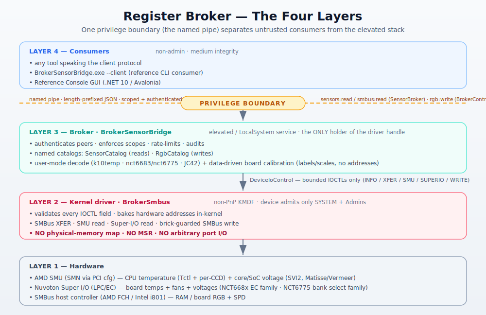
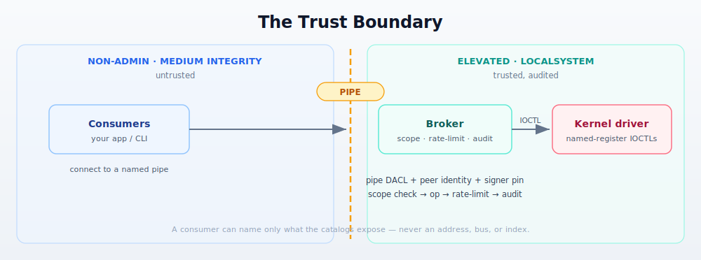
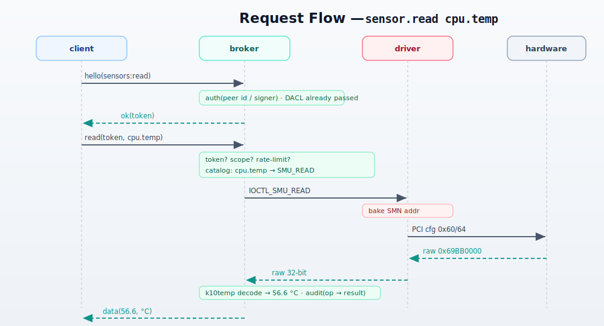

# Architecture

How the system is structured, where the privilege boundary is, and how a request flows from
a non-admin app to the hardware and back. For the line-level "how does this actually work,"
see [IMPLEMENTATION.md](IMPLEMENTATION.md); for the trust boundary and what counts as a
vulnerability, see [`SECURITY.md`](../SECURITY.md).

---

## 1. The core idea

Reading some PC sensors (Ryzen CPU temperature) and **all** RGB-over-SMBus control are
**Ring-0 operations** on Windows — there is no user-mode API. The traditional approach
(vendor RGB suites, hardware-monitor apps) is to load **WinRing0**, a kernel driver that
hands *any* caller arbitrary physical memory / MSR / port I/O, and to run the whole stack
elevated. WinRing0 is on Microsoft's vulnerable-driver block list.

**Register Broker** (the Universal Low-Level Hardware Access Framework) replaces that with
a **broker pattern**:

- **One** small, elevated process (the broker) does the privileged work, behind
- **one** narrow kernel driver that exposes *only* bounded, validated transactions, and
- exposes the results to **many** non-admin consumers over an **authenticated local channel**
  where they name *logical things* (`smu.cpu.temp`, `ram0`) instead of addressing hardware.

The win: elevation is scoped to one auditable process instead of every RGB app, and the
Ring-0 surface is a tiny, reviewable IOCTL set instead of "give me any memory."

---

## 2. The layers

---

## 3. Components and responsibilities

### Layer 2 — `BrokerSmbus` (kernel driver)
A minimal **non-PnP KMDF** driver. One control device, `\\.\BrokerSmbus`, with an SDDL that
admits only SYSTEM and Administrators. Its **entire** surface is the IOCTL contract in
[`inc/SmbusBrokerProtocol.h`](../BrokerSmbusDriver/inc/SmbusBrokerProtocol.h):

- `INFO` — version, bus count, capability bits, vendor, detected Super-I/O chip id.
- `XFER` — one bounded read-only SMBus transaction (byte/word/block ≤ 32).
- `SMU_READ` — a **named** SMU sensor (Tctl + per-CCD); the kernel bakes in the SMN address
  and returns the raw 32-bit register.
- `SUPERIO_READ` — a **named** `{kind, index}` Super-I/O sensor (temp/fan/voltage); the EC
  register is baked in.
- `SMBUS_WRITE` — a bounded byte/word/**block** write (block = 1..32 bytes in one atomic bus
  transaction), **brick-guarded in-kernel** to the RGB address windows only.

The driver returns **raw register bytes**; it never interprets values. It owns the host
controller and serializes all IOCTLs (the WDF queue is sequential — load-bearing, since the
SMBus/SMU/EC share firmware state). Detection (`SmbusDetect.c`) scans PCI and dispatches to
`SmbusAmd.c` (FCH PIIX4/SB800) or `SmbusIntel.c` (i801). `SmuAmd.c`, `SuperioNct.c`
(NCT668x EC family) and `SuperioNct6775.c` (NCT6775 bank-select family) implement the named
sensor sources; each is auto-detect-gated and inert when its chip is absent.

### Layer 3 — `BrokerSensorBridge` (broker)
A GUI-less .NET 10 `WinExe`, normally run as a **LocalSystem Windows service**. It is the
**only** process that opens the driver device. Responsibilities:

- **Authentication** — every connecting pipe client is identified by peer-process identity +
  (optionally) an Authenticode signer-thumbprint pin; the pipe DACL keeps out other users.
- **Authorization** — capability **scopes** (`sensors:read`, `smbus:read`, `rgb:write`);
  ungranted ops are denied uniformly.
- **Catalogs** — `SensorCatalog` maps logical ids → backend reads + decode; `RgbCatalog` maps
  device names → baked `(bus, address)`. Clients only ever see names.
- **Decode** — raw register → engineering units, in user mode, reproduced from Linux-hwmon
  register facts (k10temp, nct6683 lineage, nct6775, jc42 — see `THIRD-PARTY-NOTICES.md`).
- **Calibration** — board-specific labels/scales/offsets are **data**
  (`calibration.default.json` + an optional user override in `ProgramData\SensorBroker`),
  keyed by board DMI; calibration can rename/rescale/hide a channel but never address
  hardware. Legacy semantic ids (`cpu.temp`, `board.12v.volt`) resolve via a built-in alias
  map.
- **Service-grade guardrails** — per-session token-bucket rate limiting, a bounded session
  table (with a per-identity cap), and a dedicated audit log.

It has **no third-party hardware libraries** — every sensor/RGB access goes through the
project's own driver (LibreHardwareMonitor and HidSharp were fully removed 2026-06-11). It
also runs as a **second instance** for RGB: `--control` serves a separate write-only pipe
so the sensor broker never holds the write capability.

### Layer 4 — Consumers
Any process that speaks the [client protocol](CLIENT-PROTOCOL.md). The reference consumer is
`BrokerSensorBridge.exe --client`; any non-admin tool can integrate the same way. (A
personal-use RGB-app integration proved the path end-to-end before being removed from the
repo on 2026-06-11 — the framework itself is standalone and consumer-agnostic.)

---

## 4. The trust boundary

Everything to the **left** is unprivileged and untrusted. The boundary is the named pipe.
Crossing it requires, in order: (1) passing the pipe **DACL**, (2) passing the broker's
**identity/signer** gate, (3) a valid **session token**, (4) a **granted scope** for the op,
(5) the **rate limiter**. Every step is audited. A consumer can name only what the catalogs
expose — it cannot enumerate hardware, supply an address, or reach a capability the broker
doesn't offer on that pipe.

Within the elevated side, a second boundary is the **IOCTL contract**: even the broker can
only ask the driver for bounded, named, in-kernel-validated transactions. The driver does not
trust the broker — it re-validates every field and enforces the write brick-guard itself.

The trust boundary — and the attack surface each layer defends — is summarized in
[`SECURITY.md`](../SECURITY.md).

---

## 5. Request flow — `sensor.read cpu.temp`

The client named `cpu.temp` (a legacy alias the broker resolves to the stable raw id
`smu.cpu.temp` via the calibration alias map). The address (`SMN 0x00059800` via PCI config
`0x60/0x64`) lives only in the kernel; the decode (`Tctl` formula) lives only in the broker;
the consumer sees just a number and a unit. `sensor.readall` returns the whole catalog in one
rate-limited op.

`rgb.set ram0 00FF00` is the same shape on the control pipe: `rgb:write` scope → `RgbCatalog`
resolves `ram0` → baked `(bus 0, 0x39)` → `IOCTL_SMBUS_WRITE` → in-kernel brick-guard confirms
the address is in an RGB window → ENE write sequence (each LED's 3 color bytes go out as one
atomic block write; DIRECT mode + APPLY are latched once per controller).

### 5.1 RGB transports & their safety boundaries

DRAM RGB is on the SMBus; **motherboard headers and USB peripherals are not** — they need other
transports. Board RGB comes from a DMI-matched `RgbCatalog` board profile of zones, each tagged
with a transport; **USB-HID peripherals (Razer Chroma) are board-independent** — matched by USB
vendor/product/interface+usage, not the board profile. The client contract (`rgb.list`/`rgb.set`)
is identical across all transports. What bounds a write differs:

| Transport | Hardware | Path | Safety boundary | Status |
|---|---|---|---|---|
| `SmbusEne` | ENE/Aura DRAM | `IOCTL_SMBUS_WRITE` | **Kernel** address brick-guard (`0x70–0x77` / `0x39–0x3A`) | validated |
| `SuperioEc` | NCT6687 12V header (JRGB) | `IOCTL_SUPERIO_RGB_WRITE` | **Kernel** EC RGB-register brick-guard | wired but **inert** — `SuperioRgbImplemented`/`CAP_SUPERIO_RGB` off until the EC RGB window is hardware-validated |
| `UsbHid` | MSI Mystic Light headers + many USB-HID peripherals (Logitech, SteelSeries, Corsair iCUE V2, HyperX, Cooler Master, NZXT, Roccat, Redragon, ASUS, Lian Li, AMD Wraith Prism — see `RGB-DEVICE-COVERAGE.md`) | user-mode HID feature/output/input reports | **Broker only** — baked report builder, *no kernel guard* | `AllowHidRgb` **on by default** (set `false` to opt out); MSI Mystic Light validated, most peripherals HW-unvalidated |
| `UsbHidRazer` | Razer Chroma keyboards / mice | user-mode HID feature reports (90-byte extended-matrix protocol) | **Broker only** — baked report builder, *no kernel guard* | `AllowHidRgb` **on by default**; **validated** (Naga Trinity, Cynosa Chroma — 2026-06-17) |

**Driver-stability contract:** adding a board/zone — or a USB-HID peripheral — is a **broker-only**
change. The kernel exposes only stable, class-wide write windows (the SMBus RGB range; the NCT6687
RGB register region, a property of the silicon), and USB-HID is entirely user-mode, so new
controllers/boards/peripherals never require a driver recompile — which also avoids the
re-signed-`.sys` time bomb. The driver changes only for a genuinely new kernel transport class or
Super-I/O / SMBus vendor family.

The USB-HID paths are the **corrected** re-introduction of a user-mode HID transport scoped to RGB
only; the retired Gigabyte IT8297 path stays retired (design record: `docs/GIGABYTE-SUPPORT.md`).
Razer command collections are owned by the OS HID input stack, so `HidDevice` opens them with a
zero-access fallback (feature reports work on a 0-access handle) and binds the command collection
by its `(interface, usage)` tuple — the same discriminator the reference Razer/OpenRazer protocol
uses.

### 5.2 User-mode sensor backends — a distinct reduced-assurance layer

Most sensors ride the kernel driver (Layer 2): the SMBus/Super-I/O/SMU reads, and the
brick-guarded SMBus writes, are all bounded, in-kernel-validated transactions. **Some sources
are not on the motherboard's kernel-reachable buses at all**, so the broker reads them in
**user mode** via a vendor/OS API instead of the driver:

| Group | Backend | Assurance |
|---|---|---|
| `gpu.*` | AMD ADL / NVIDIA NVML / Intel Level Zero Sysman (selected per machine) | user-mode, **read-only**, no kernel guard; opt-in `AllowGpuSensors` (default off) |
| `aqua.*` | Aquacomputer USB-HID controller (Quadro `0x0C70:0xF00D`) — blocking `ReadFile` on the HID interrupt-IN endpoint | user-mode, **read-only**, no kernel guard; opt-in `AllowAquaSensors` (default off); **removable** (hot-pluggable, flagged in `sensor.list`) |

These are a deliberately **separate, reduced-assurance layer** from the kernel-brick-guarded
sources: they involve no kernel surface (so there is nothing for the in-kernel guard to bound),
they are **strictly read-only** (no write op is resolved for them), and each is **opt-in, off by
default** with the same posture as the user-mode USB-HID RGB transport. The catalog ids appear
the same way to a client; the assurance difference is a deployment property, not a protocol one.
Design records: `docs/GPU-SENSOR-SUPPORT.md`, `docs/AQUA-SENSOR-SUPPORT.md`.

### 5.3 Gating & hardening posture

The privileged surface is held narrow by default and widened only by explicit operator opt-in:

- **Opt-in flags** gate the reduced-assurance paths — `AllowHidRgb` (USB-HID RGB; **on** by
  default), `AllowGpuSensors` (off), `AllowAquaSensors` (off). A path that isn't enabled isn't
  loaded.
- **USB-HID RGB zones are pinned by USB product id.** An *unpinned* zone (matched only by
  feature-report length) is **bring-up-only** — refused unless `AllowUnpinnedHidRgb` /
  `--rgb-allow-unpinned-hid` is set (default off) — so a shipped profile never drives an
  unintended device.
- **Vendor GPU DLLs load hijack-safe.** `atiadlxx.dll` / `nvml.dll` / `ze_loader.dll` are loaded
  by **absolute `System32` path**, never by bare name, to avoid current-directory / search-order
  DLL hijack.

---

## 6. Why it's structured this way (key decisions)

| Decision | Rationale |
|---|---|
| **Named pipe, not TCP** | OS ACLs, no remote reachability, and the broker can read the peer's process identity/signature. There is **no** TCP/HTTP surface (the legacy HTTP feed was removed). |
| **Identity auth, no shared secret** | A per-user secret file fits a per-user app, not a system service; binding to *who the binary is* (DACL + identity + signer pin) is the stronger, service-appropriate anchor and has nothing to leak/rotate. |
| **Driver returns raw bytes; broker decodes** | Keeps the Ring-0 surface minimal and dumb; all model-specific logic (and bugs) stay in user mode where they're cheap to fix. |
| **Named catalogs, no client addressing** | A consumer that can't supply an address can't scan the bus or steer a write — the catalog *is* the allowlist. |
| **In-kernel brick-guard** | The kernel refuses writes outside the RGB window regardless of the broker, so a broker bug can't brick a DIMM's SPD. |
| **Two services (sensor vs control)** | The sensor broker never holds the write capability; RGB write is an opt-in, separately-scoped process. |
| **Sequential IOCTL queue** | SMBus/SMU/EC share firmware state; serializing all IOCTLs is the single hardware lock. |
| **RGB is one thin layer; effects are consumer-side** | The broker writes colors (`rgb.set`), nothing more. Animation lives in the consumer, which renders frames and streams per-LED updates — so the privileged surface never grows an effects engine, and every consumer can have its own. Broader controller coverage is planned as a separate license-isolated sidecar process (a deferred post-1.0 design), not as broker code. |

---

## 7. Current state & what's missing

Working and hardware-validated (AMD dev box): the full read path (CPU via SMU incl. per-CCD,
board via NCT6687D Super-I/O, DIMM temps + SPD over SMBus), non-admin per-LED RGB write, the
identity-authenticated pipe, and the Windows-service packaging.

Also working as user-mode reduced-assurance read backends (§5.2, opt-in): `gpu.*` GPU telemetry
(AMD ADL validated on an RX 7900 XTX; NVIDIA/Intel built, HW-unvalidated) and `aqua.*`
Aquacomputer telemetry (Quadro validated on the dev box). On the dev box the live catalog is
**~61 ids** (43 base + 9 `gpu.*` + 9 `aqua.*`).

Built but **not hardware-validated**: the **Intel i801** SMBus backend and the **NCT6775
bank-select Super-I/O family** (NCT6683/6686 are register-identical to the validated 6687D
but also unvalidated) — community testing welcome, see [TESTING.md](TESTING.md). The ITE
IT87xx / Gigabyte USB-HID backends were retired 2026-06-11 after expert corrections and are
no longer in the tree (the `KIND_ITE` wire value stays reserved so it is never reused).

Not yet done: **production driver signing** (today's driver is test-signed — lab machines
only), flipping `RequireAuthorizedClient` on by default (still audit-only), SMU PM-table
metrics (CPU package power / clocks — these need the SMU mailbox + a physical-memory read of
the DMA'd table, which the narrow driver deliberately won't do; CPU **voltages** shipped in
1.4.0 because they read as fixed named registers), and SMBus writes outside the RGB windows
(deliberately refused). **Storage temperature / SMART** was investigated and found to require an
**admin-only** access path, so it is **not** in the non-admin sensor path and stays deferred. The
productionization path is [SIGNING-AND-DEPLOYMENT.md](SIGNING-AND-DEPLOYMENT.md); release
history is in [`CHANGELOG.md`](../CHANGELOG.md).
